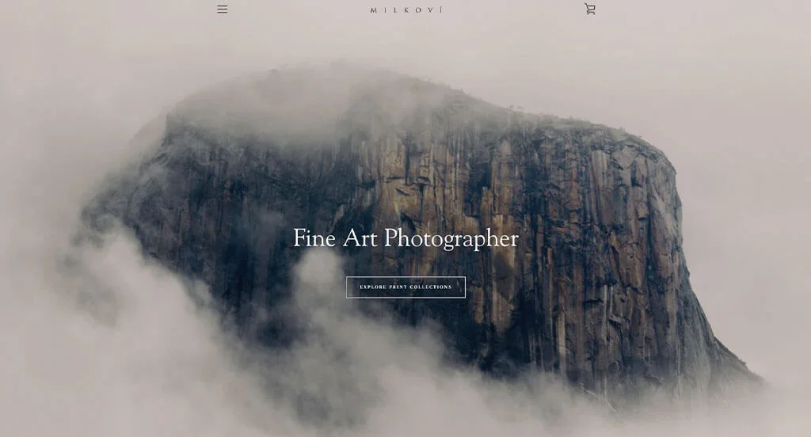

<!doctype html>
<html lang="en">
  <head>
    <meta charset="utf-8">
    <meta name="viewport" content="width=device-width, initial-scale=1">
    <title>Bootstrap demo</title>
    <link href="https://cdn.jsdelivr.net/npm/bootstrap@5.3.3/dist/css/bootstrap.min.css" rel="stylesheet" integrity="sha384-QWTKZyjpPEjISv5WaRU9OFeRpok6YctnYmDr5pNlyT2bRjXh0JMhjY6hW+ALEwIH" crossorigin="anonymous">
  </head>
  <body>
    
    <nav class="navbar navbar-expand-lg bg-body-tertiary">
        

          <a class="navbar-brand" href="bootstrap.html">Photography</a>
          <button class="navbar-toggler" type="button" data-bs-toggle="collapse" data-bs-target="#navbarSupportedContent" aria-controls="navbarSupportedContent" aria-expanded="false" aria-label="Toggle navigation">
            
          </button>
          

            <ul class="navbar-nav ms-auto mb-2 mb-lg-0">
              <li class="nav-item">
                <a class="nav-link active" aria-current="page" href="bootstrap.html">Home</a>
              </li>
              <li class="nav-item">
                <a class="nav-link" href="bootstrap.html#Ab">About Us</a>
              </li>
              <li class="nav-item">
                <a class="nav-link" aria-disabled="true" href="bootstrap.html#Os">Our Services</a>
              </li>
              <li class="nav-item">
                <a class="nav-link" href="bootstrap.html#Cu">Contact Us</a>
              </li>
            
              
            </ul>
            <form class="d-flex" role="search">
              <input class="form-control me-2" type="search" placeholder="Search" aria-label="Search">
              <button class="btn btn-outline-success" type="submit">Search</button>
            </form>
          

        

      </nav>
      

        

          <button type="button" data-bs-target="#carouselExampleDark" data-bs-slide-to="0" class="active" aria-current="true" aria-label="Slide 1"></button>
          <button type="button" data-bs-target="#carouselExampleDark" data-bs-slide-to="1" aria-label="Slide 2"></button>
          <button type="button" data-bs-target="#carouselExampleDark" data-bs-slide-to="2" aria-label="Slide 3"></button>
          <button type="button" data-bs-target="#carouselExampleDark" data-bs-slide-to="3" aria-label="Slide 4"></button>
     
        

        

          

            
            

              <h1 style="color: aliceblue;">sea</h1>
              
sea Don't stress over this, babies and newborn photography is fun.

            

          

          

            
            

              <h1 style="color: aliceblue;">nature</h1>
              
Don't stress over this, babies and newborn photography is fun.

            

          

          

            
            

              <h1 style="color: aliceblue;">moon</h1>
              
 Don't stress over this, babies and newborn photography is fun.

            

          

        

          
          

            <h1 style="color: aliceblue;">water</h1>
            
 Don't stress over this, babies and newborn photography is fun.

          

        

      
        

      

        <button class="carousel-control-prev" type="button" data-bs-target="#carouselExampleDark" data-bs-slide="prev">
          
          Previous
        </button>
        <button class="carousel-control-next" type="button" data-bs-target="#carouselExampleDark" data-bs-slide="next">
          
          Next
        </button>
      

      

      <h1>ABOUT US</h1>
      

      

      

        

          

            
Explore Royal Photography

             
 Where Every photo speaks a story 
              We liked how this photography site combined the colors of black and white to create an attractive website design. The balance of negative and positive space was probably the most impactful feature in the homepage of this website. Another thoughtful quality in this custom photographer website was their simple checkout process. Milkovi had website marketing in mind when building the collections for their prints within their website. What a great website to review when building out your next photography website!

              

          

          

            
          

          

         
        

      

      

        <h1>OUR SERVICES</h1>
        

        

        

          

            

              

                
                

                  <h5 class="card-title">SEA</h5>
                  
The ever-changing texture of sea water reflects both calm and chaos—its fluid motion tells stories of time, depth, and mystery. This element brings life, movement, and emotion to the frame.

                  

                

               
                
              

            

            

              

                
                

                  <h5 class="card-title">nature</h5>
                  
Nature is the soul of this image. From the gentle sway of coastal winds to the organic flow of the waves, it represents a raw, untouched beauty that speaks for itself.

                  

                

                
                
              

            

            

              

                
                

                  <h5 class="card-title">moon</h5>
                  
The moon brings a quiet magic to the scene—a soft, silver glow that contrasts the dark sea and sky. It evokes stillness, mystery, and the quiet power of the night. 

                

               
                
              

            

          

        

        

          

            

              

                
                

                  <h5 class="card-title">water</h5>
                  
The ocean is vast and timeless. In this image, it becomes a symbol of freedom and depth, inviting viewers to pause, reflect, and feel the immensity of the natural world.

                

                
              

            

           
            
          

        

        

          <h1>CONTACT US</h1>
          

          

          

            

              

                <form class="text-centers mt-5" style="background-color: rgb(241, 240, 240); border-radius: 5px; box-shadow: 10%;">
                  

                    <label for="exampleInputEmail1" class="form-label">Name</label>
                    <input type="text" class="form-control mx-auto" id="exampleInputEmail1" aria-describedby="emailHelp" style="width: 500px;">
                  

                  

                    <label for="exampleInputEmail1" class="form-label">Email address</label>
                    <input type="email" class="form-control mx-auto" id="exampleInputEmail1" aria-describedby="emailHelp" style="width: 500px;">
                  

                  

                    <label for="exampleInputPassword1" class="form-label mx-auto">Phone Number</label>
                    <input type="number" class="form-control mx-auto" id="exampleInputPassword1"  style="width: 500px;">
                  

                  

                    <input type="checkbox" class="form-check-input" id="exampleCheck1">
                    <label class="form-check-label" for="exampleCheck1">Check me out</label>
                  

                  <button type="submit" class="btn btn-primary" onclick="alert(We will get back to you soon)">Submit</button>
                </form>
              

              

                
              

            

          

          

    

  </body>

</html>
